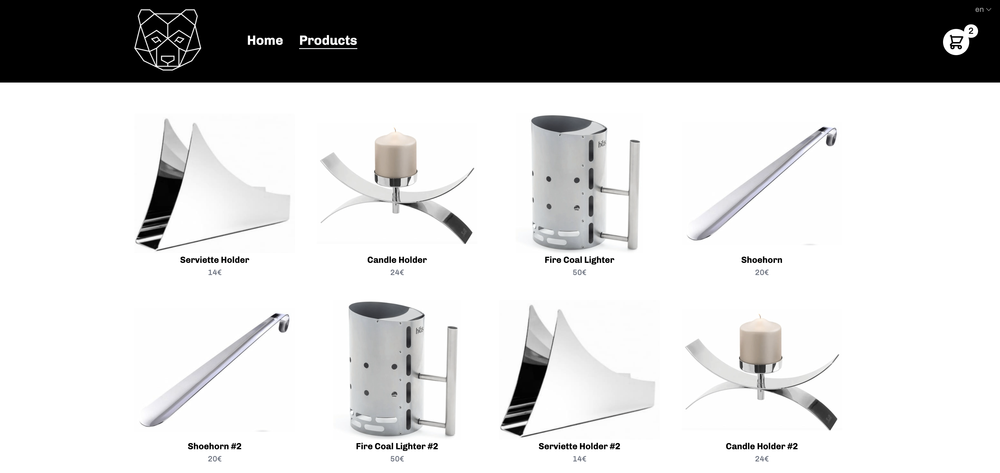

# Organic Pet Food Store

An Open Source Ecommerce Shop for selling high-quality organic pet food, built with [SvelteKit](https://kit.svelte.dev/) and [Tailwind CSS](https://tailwindcss.com/).


## [Check out the Demo](https://master--nimble-zabaione-e0b961.netlify.app/)



# Features

- SvelteKit as js Framework (mix of SSR and SPA)
- Tailwind as css Framework
- 🚀 Superfast
- Full responsive -> in Mobile, Tablet and Web Browser Size
- Smooth and cool Animations
- Intuitive Cart Design
- Form Validation for shipping and billing with yup and svelte-forms-lib
- Usage of Stores and localStorage
- i18n implementation (English and German Language available)
- Minimalistic Black and White UI Design

# Getting started

### Install and run SvelteKit with the commands below:

```bash
git clone https://github.com/martykuentzel/sveltekit-tailwind-ecommerce.git
cd sveltekit-tailwind-ecommerce
npm install
npm run dev
```

OR

Just ...

[](https://app.netlify.com/start/deploy?repository=https://github.com/martykuentzel/sveltekit-tailwind-ecommerce)

And that's it!
